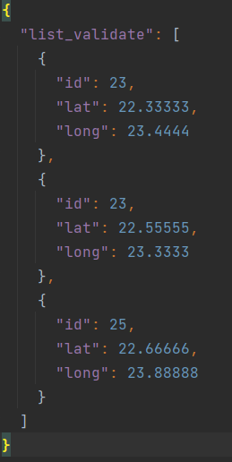
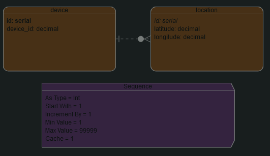
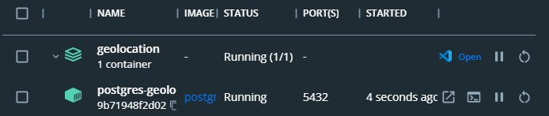
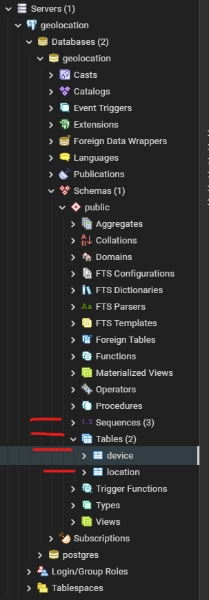
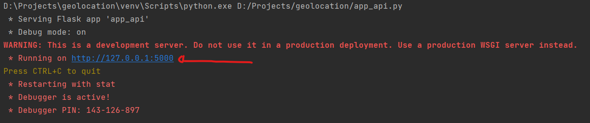
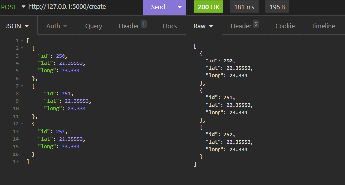
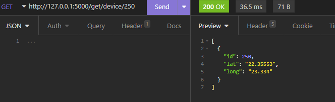
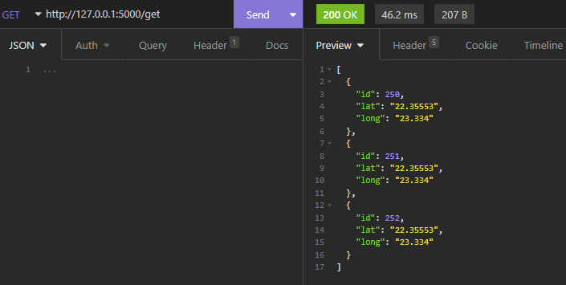

# Geolocation API

## Contexto
Pensando em criar uma API de informações de _geolocation_, é necessária a construção de 2 _end-points_.
Um POST que receba como _body_ o json abaixo podendo então gravar no banco de dados as informações em 2 tabelas.
Uma de Devices, e uma de Localização.
A de _Devices_, que deve conter o _id_ do _device_, e a de Localização, que deve conter os pontos de longitude e latitude.
O segundo _end-point_ seria um GET para retorno dos dados gravados no banco, podendo filtrar por _ID_.

Abaixo, o modelo do JSON:



## Tecnologias utilizadas
- Python 3x
- Flask
- Postgres
- Docker

## Análise inicial

No modelo sugerido para recebimento de dados via POST, nota-se uma lista com item referentes: id do dispositivo,
 latitude e longitude. Foi pensado em criar as tabelas seguindo o modelo ER abaixo:



Onde cada _device_ pode conter dados de geolocalização em momentos diferentes, por isso a relação 1:n.

## O que você precisa para executar o projeto
- Docker
- Git
- Python 3x
- Pip (ou outro gerenciador de pacotes)
- PostgreSQL (usado em contâiner neste projeto)

## Como executar o projeto

  ```
  OBS: Todos os comando abaixo devem ser executados via CLI
  ```

* Em um diretório na sua máquina e de sua preferência, execute o comando abaixo via terminal
para clonar o repositório do GitHub

  ```
  git clone https://github.com/dwsilva/geolocation.git
  ```
* Instalar as _libs_ necessárias para a execução do projeto onde o clone foi realizado
    ```
    pip install -r requirements.txt
    ```
* Com o _docker_ iniciado em sua máquina, execute o _docker-compose_ encontrado na raiz do projeto
  ```
  docker-compose up -d
  ```
  Será utilizada a porta padrão do Postgre, por isso você deve garantir que a mesma esteja disponível para isso.
  
  

* Navegue até src/creator/ e execute o arquivo database.py
  ```
  python database.py
  ```
  
  

* Na raiz do projeto, execute o arquivo app_api.py
  ```
  python app_api.py
  ```
  Feito isso você verá uma mensagem como esta em seu console:
  
  
  
  Localmente seu projeto irá ser utilizado em http://127.0.0.1:5000

## Como utilizar

* Exitem 3 possíveis requisições que podem ser utilizadas para este projeto:
  * Enviar registros (POST) -> http://127.0.0.1:5000/create
    * Obrigatótio o envio de informações no _body_ da requisição em formato _json_ e dentro de um _array_, seguindo o modelo fornecido e informado em etapas anteriores.
      ```
      [{"id": 250,"lat": 22.35553,"long": 23.334},{"id": 251,"lat": 22.35553,"long": 23.334},{"id": 252,"lat": 22.35553,"long": 23.334}]
      ```
      
    
  * Solicitar um único registro por ID (GET) -> http://127.0.0.1:5000/get/device/<id_do_device>
    ```
      http://127.0.0.1:5000/get/device/250
    ```
    
    
  * Solicitar todos os registros existentes (GET) -> http://127.0.0.1:5000/get/
    ```
      http://127.0.0.1:5000/get/
    ```
    